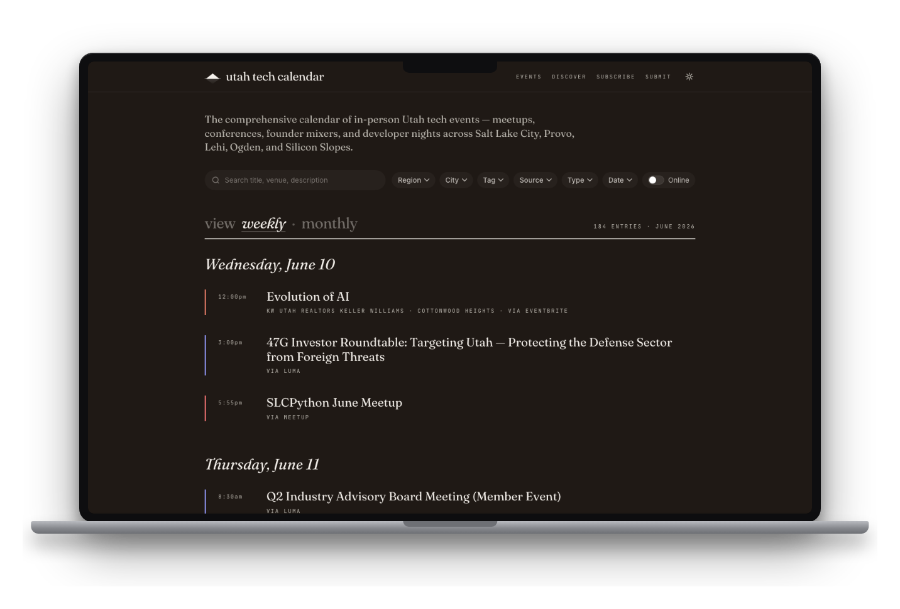

# Utah Tech Calendar

A free, comprehensive calendar of **in-person Utah tech events** — meetups, conferences, founder mixers, and developer nights across Salt Lake City, Provo, Lehi, Ogden, and Silicon Slopes.

Live at **[utahtechcalendar.com](https://utahtechcalendar.com)**. No login, no tracking, nothing to sign up for.

<p align="center">
  <a href="https://utahtechcalendar.com">
    
  </a>
</p>

## Why this exists

The Utah tech scene is busy, but it lives in a dozen places at once: Meetup, Luma, Eventbrite, Substack, and a scatter of org sites. This project pulls all of it into one filterable page so you can answer "what's the AI thing in Lehi on Thursday" in one read instead of opening five tabs.

Three things it aims to do well:

1. **Comprehensive sourcing** — well beyond Meetup. Multiple scraper adapters plus community submissions.
2. **Comprehensive filters** — by region, city, tech type/tag, source, date, and online vs. in-person.
3. **Comprehensive subscriptions** — iCal feed, RSS, Google Calendar, and email digests.

## How it works

```
sources table ──> scraper adapters ──> events table ──> filtered UI + feeds (iCal/RSS/email)
```

- Each row in the `sources` table names an **adapter** and a **URL** (plus optional JSON config).
- A scheduled cron walks enabled sources, runs the matching adapter, and upserts into `events` on `(source, external_id)`.
- The front end filters `events` at query time; region is derived from city, not stored, so there's one source of truth.

### Adapters

| Adapter | Source |
|---|---|
| `meetup` | Meetup group event lists |
| `luma` | lu.ma calendars |
| `eventbrite` | Eventbrite search/org pages |
| `siliconSlopes` | Silicon Slopes (Circle.so) |
| `substack` | Substack newsletter events |
| `utahGeekEvents` | Utah Geek Events |
| `recurrence` | Generated recurring series (e.g. 1 Million Cups) |
| `htmlCalendar` | Generic HTML/JSON-LD calendars (BioUtah, Altitude Lab, SAINTCON, …) |

Adding a new source usually means inserting a `sources` row — no code — as long as an existing adapter fits. New *kinds* of source need a new adapter. See [CONTRIBUTING.md](CONTRIBUTING.md).

<p align="center">
  
</p>

## Stack

- **Next.js 16** (App Router) + **React 19**
- **Tailwind v4** + shadcn (base-maia)
- **Neon Postgres** + **Drizzle ORM**
- **Vercel** (hosting + Cron) — `CRON_SECRET` Bearer auth
- **Resend** for moderation + email digests
- **Bun** for local dev and scripts

## Local development

```bash
bun install
cp .env.local.example .env.local   # fill in the values (see below)
bun run dev                        # http://localhost:3000
```

You need a Postgres database (Neon's free tier is plenty). Required env vars are documented in [`.env.local.example`](.env.local.example); the only one needed to boot the UI against a seeded DB is `DATABASE_URL`.

```bash
bun run db:push                                # apply schema to your DB
bun scripts/seed-sources.ts                    # populate the sources table
bun scripts/one-shot-scrape.ts <adapter> <url> # try an adapter ad-hoc
```

## Contributing

Contributions welcome — new sources, adapters, filters, and bug reports. Start with [CONTRIBUTING.md](CONTRIBUTING.md) and the open issues. Adding your group's calendar can be as small as one row.

## Maintainers

Built and maintained together, as equals:

- [Benjamin Reece](https://github.com/bnjreece) — co-creator & maintainer
- [Clint Berry](https://github.com/clintberry) — co-creator & maintainer ([utahdev.events](https://utahdev.events))

Utah Tech Calendar is the combined successor to utahdev.events, merging forces to give the community one comprehensive, well-filtered place to find in-person tech events.

## Forge Utah

Built in partnership with the [**Forge Utah Foundation**](https://forgeutah.tech) — helping Utah technologists share, learn, and build ([GitHub](https://github.com/forgeutah)). 🙌

## License

[MIT](LICENSE) © Benjamin Reece & Clint Berry
